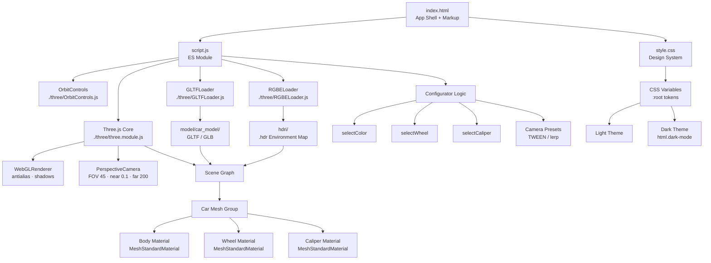

<div align="center">

```
██████╗ ██████╗ ███████╗███╗   ███╗██╗██╗   ██╗███╗   ███╗
██╔════╝██╔═══██╗██╔════╝████╗ ████║██║██║   ██║████╗ ████║
██║     ██║   ██║███████╗██╔████╔██║██║██║   ██║██╔████╔██║
██║     ██║   ██║╚════██║██║╚██╔╝██║██║██║   ██║██║╚██╔╝██║
╚██████╗╚██████╔╝███████║██║ ╚═╝ ██║██║╚██████╔╝██║ ╚═╝ ██║
 ╚═════╝ ╚═════╝ ╚══════╝╚═╝     ╚═╝╚═╝ ╚═════╝ ╚═╝     ╚═╝

███████╗ ██████╗ ██████╗  ██████╗ ███████╗
██╔════╝██╔═══██╗██╔══██╗██╔════╝ ██╔════╝
█████╗  ██║   ██║██████╔╝██║  ███╗█████╗
██╔══╝  ██║   ██║██╔══██╗██║   ██║██╔══╝
██║     ╚██████╔╝██║  ██║╚██████╔╝███████╗
╚═╝      ╚═════╝ ╚═╝  ╚═╝ ╚═════╝ ╚══════╝
```

**— AUTOMOTIVE STUDIO —**

*Real-time 3D car configurator. Built for obsessives.*

<br/>

[](https://threejs.org)
[](https://developer.mozilla.org/en-US/docs/Web/JavaScript)
[](https://developer.mozilla.org/en-US/docs/Web/HTML)
[](https://developer.mozilla.org/en-US/docs/Web/CSS)
[](https://www.khronos.org/webgl/)

<br/>

[](LICENSE)
[]()
[]()
[]()
[]()

<br/>

> 🏎️ &nbsp;[**Live Demo**](#) &nbsp;·&nbsp; 📖 &nbsp;[**Documentation**](#table-of-contents) &nbsp;·&nbsp; 🐛 &nbsp;[**Report Bug**](#) &nbsp;·&nbsp; ✨ &nbsp;[**Request Feature**](#)

</div>

---

## Table of Contents

<details open>
<summary><b>Click to expand / collapse</b></summary>

- [Overview](#-overview)
- [Feature Matrix](#-feature-matrix)
- [Architecture](#-architecture)
- [Project Structure](#-project-structure)
- [Tech Stack](#-tech-stack)
- [Getting Started](#-getting-started)
  - [Prerequisites](#prerequisites)
  - [Installation](#installation)
  - [Running Locally](#running-locally)
- [Configuration Limits](#-configuration-limits)
  - [3D Model Limits](#3d-model-limits)
  - [HDRI Lighting Limits](#hdri-lighting-limits)
  - [Body Color Limits](#body-color-limits)
  - [Wheel Limits](#wheel-limits)
  - [Brake Caliper Limits](#brake-caliper-limits)
  - [Camera Preset Limits](#camera-preset-limits)
  - [Layout & Responsive Limits](#layout--responsive-limits)
  - [Performance Limits](#performance-limits)
  - [Browser Limits](#browser-limits)
  - [Asset File Size Limits](#asset-file-size-limits)
- [Design System](#-design-system)
  - [Typography](#typography)
  - [Color Tokens](#color-tokens)
  - [Layout Metrics](#layout-metrics)
  - [Responsive Breakpoints](#responsive-breakpoints)
- [Vehicle Specification Panel](#-vehicle-specification-panel)
- [Customisation Guide](#-customisation-guide)
  - [Adding a Paint Color](#adding-a-paint-color)
  - [Adding a Wheel Style](#adding-a-wheel-style)
  - [Adding a Brake Caliper](#adding-a-brake-caliper)
  - [Replacing the Car Model](#replacing-the-car-model)
  - [Changing the HDRI](#changing-the-hdri)
  - [Adding a Camera Preset](#adding-a-camera-preset)
- [Dark Mode](#-dark-mode)
- [Keyboard & Interaction Reference](#-keyboard--interaction-reference)
- [Known Limitations & Roadmap](#-known-limitations--roadmap)
- [FAQ](#-faq)
- [License](#-license)

</details>

---

## 🌌 Overview

**Cosmic Forge** is a zero-backend, zero-npm, browser-native 3D automotive configurator. It loads a GLTF car model into a Three.js WebGL scene, applies real-time material swaps for paint, wheels, and brake calipers, and presents everything inside a studio-grade UI with full dark/light theming.

```
┌─────────────────────────────────────────────────────────────────────────┐
│  TOPBAR  │  Engine · Power · 0–100 · Drivetrain · Top Speed  │  Price   │
├─────────────────────────────────────────────────────────────────────────┤
│                                                                         │
│                     THREE.JS WebGL STAGE                                │
│              (OrbitControls · HDRI · Shadow plane)                      │
│                                                                         │
│  [ Car Label ]          [ View Tabs ]          [ VD Panel ]             │
│                                                                         │
│  [ ← Share ]                                  [ Rotate → ]  [ ☀ / ☾ ] │
│                                                                         │
│           [ 3/4 Front ]  [ Side ]  [ Rear ]  [ Top ]  [ HYPER DRIVE → ]│
├─────────────────────────────────────────────────────────────────────────┤
│  BOTTOM PANEL  │  Nav  │  Body Color  │  Wheels  │  Brake Calipers      │
├─────────────────────────────────────────────────────────────────────────┤
│  FOOTER  │  ● Live Changes  │  Save Build  │  Share                     │
└─────────────────────────────────────────────────────────────────────────┘
```

---

## 🎯 Feature Matrix

| Feature | Status | Notes |
|---|:---:|---|
| 3D real-time render | ✅ | Three.js WebGL2 |
| Drag-to-rotate (OrbitControls) | ✅ | Mouse + touch |
| HDRI environment lighting | ✅ | `.hdr` / `.exr` |
| Body paint selector — 8 colors | ✅ | Hex int material swap |
| Wheel finish selector — 3 styles | ✅ | Canvas-drawn previews |
| Brake caliper selector — 3 colors | ✅ | Real-time material update |
| Camera presets — 4 angles × 2 | ✅ | Click + double-click |
| Dark / Light mode toggle | ✅ | Persisted in `localStorage` |
| Premium orbital loading screen | ✅ | Animated SVG arc |
| Animated progress bar | ✅ | Smooth GPU-driven |
| Focus config panel — expanded | ✅ | Body / Wheel / Brake cards |
| Vehicle data overlay panel | ✅ | Chassis + performance specs |
| Responsive layout | ✅ | 1280px + 900px breakpoints |
| Hyper Drive animation | ✅ | Idle camera drift mode |
| Zero runtime CDN dependencies | ✅ | All libs bundled locally |
| Save Build — backend | 🔲 | UI placeholder only |
| Share URL — deep link | 🔲 | UI placeholder only |
| Interior view 3D | 🔲 | Requires separate camera rig |
| AR / XR mode | 🔲 | Planned — WebXR API |

---

## 🏗 Architecture



---

## 📁 Project Structure

```
cosmic-forge/
│
├── 📂 hdri/
│   └── *.hdr / *.exr              # HDRI environment maps (2K recommended)
│
├── 📂 images/
│   └── Logo.png                   # Brand logo — loader + topbar
│
├── 📂 model/
│   └── car_model/
│       ├── *.glb  OR              # Self-contained binary GLTF (preferred)
│       ├── *.gltf + *.bin         # Split GLTF + binary buffer
│       └── textures/              # External texture maps (if split GLTF)
│
├── 📂 three/
│   ├── three.module.js            # Three.js core (ES Module build)
│   ├── OrbitControls.js           # Camera interaction
│   ├── GLTFLoader.js              # GLTF / GLB loader
│   └── RGBELoader.js              # HDRI loader
│
├── 📄 index.html                  # App shell, all markup, font imports
├── 📄 script.js                   # Scene setup, configurator, camera logic
└── 📄 style.css                   # Full design system (light + dark)
```

---

## 🛠 Tech Stack

<div align="center">

| Layer | Technology | Version |
|---|---|---|
| Renderer | Three.js WebGLRenderer | r152+ |
| Camera Control | OrbitControls | bundled with Three.js |
| Model Format | GLTF 2.0 / GLB | Khronos spec |
| Lighting | HDRI — RGBELoader | RGBE / EXR |
| Language | Vanilla JavaScript | ES2022 modules |
| Styling | CSS3 Custom Properties | No preprocessor |
| Fonts | Google Fonts — 5 families | Loaded via `<link>` |
| Build System | **None** | Zero config |
| Package Manager | **None** | Zero npm |
| Runtime CDN | **None** | Fully self-hosted |

</div>

---

## 🚦 Getting Started

### Prerequisites

| Requirement | Minimum | Recommended |
|---|---|---|
| Browser | Chrome 90 / Firefox 88 / Safari 15 / Edge 90 | Latest stable |
| WebGL | WebGL 1.0 | WebGL 2.0 |
| GPU | Integrated — Intel UHD 620+ | Dedicated — GTX 1060+ |
| RAM per tab | 256 MB | 512 MB+ |
| Internet | Only for Google Fonts | — |
| Static server | **Required** | Any — see below |

> ⚠️ **`file://` will not work.** The app uses `<script type="module">` which browsers block on the local filesystem due to CORS policy. You **must** serve it over HTTP.

### Installation

```bash
# Clone the repository
git clone https://github.com/your-org/cosmic-forge.git
cd cosmic-forge

# No npm install. No build step. That's it.
```

### Running Locally

<details>
<summary><b>Option A — Python (zero install, macOS / Linux / Windows)</b></summary>

```bash
python3 -m http.server 8080
# Open → http://localhost:8080
```

</details>

<details>
<summary><b>Option B — Node.js serve</b></summary>

```bash
npx serve .
# URL printed in terminal — usually http://localhost:3000
```

</details>

<details>
<summary><b>Option C — VS Code Live Server</b></summary>

1. Install extension: **Live Server** by Ritwick Dey
2. Right-click `index.html`
3. Select **Open with Live Server**
4. Browser opens automatically at `http://127.0.0.1:5500`

</details>

<details>
<summary><b>Option D — PHP</b></summary>

```bash
php -S localhost:8080
```

</details>

<details>
<summary><b>Option E — Docker (isolated, production-like)</b></summary>

```bash
docker run -p 8080:80 -v $(pwd):/usr/share/nginx/html nginx:alpine
# Open → http://localhost:8080
```

</details>

---

## ⚙️ Configuration Limits

### 3D Model Limits

| Limit | Value | Notes |
|---|---|---|
| Supported formats | GLTF 2.0 / GLB | OBJ / FBX not supported without extra loaders |
| Binary GLB | ✅ Preferred | Single file, no broken texture paths |
| Split GLTF + BIN | ✅ Supported | Textures must be relative paths |
| Embedded textures | ✅ Supported | Increases `.glb` file size |
| External textures | ✅ Supported | Must live in `model/car_model/textures/` |
| Max recommended triangles | ~500,000 | Maintains 60 fps on mid-range GPU |
| Max triangles — high-end | ~1,500,000 | RTX 3060+ class hardware |
| Mesh naming — body | Defined in `script.js` | Update `BODY_MESH_NAMES` array |
| Mesh naming — wheels | Defined in `script.js` | Update `WHEEL_MESH_NAMES` array |
| Mesh naming — calipers | Defined in `script.js` | Update `CALIPER_MESH_NAMES` array |
| Animations | Supported via `AnimationMixer` | Not wired by default |
| Max practical file size | ~50 MB | Larger files delay initial load significantly |

### HDRI Lighting Limits

| Limit | Value | Notes |
|---|---|---|
| Supported formats | `.hdr` (RGBE), `.exr` | `.exr` requires `EXRLoader` import |
| Path | `./hdri/` | Update `HDRI_PATH` constant in `script.js` |
| Minimum resolution | 1K — 1024×512 | Visible seams on glossy surfaces |
| Recommended resolution | 2K — 2048×1024 | Best quality / performance balance |
| Maximum practical | 4K — 4096×2048 | May cause GPU memory spikes on low-end hardware |
| Tone mapping | `THREE.ACESFilmicToneMapping` | Modify `renderer.toneMapping` |
| Exposure | `1.0` default | Adjust `renderer.toneMappingExposure` |
| Multiple HDRI switching | Not wired by default | Dispose old `PMREMGenerator` textures to avoid leaks |

### Body Color Limits

| Limit | Value | Notes |
|---|---|---|
| Max colors — compact grid | **8** | `4 × 2` CSS grid layout |
| Max colors — focus panel | **8** | `4 × 2` CSS grid layout |
| Practical max before overflow | **12** | Adds a 3rd row — increase `--h-bot` |
| Color format | Hex integer `0xRRGGBB` | Passed to `THREE.Color` |
| Checkmark stroke — light colors | `#333` | e.g. Giallo Orion yellow |
| Checkmark stroke — dark colors | `#fff` | All other swatches |

**Default palette:**

| Name | Hex | Finish |
|---|---|---|
| Giallo Orion | `#F5C518` | Premium Solid |
| Viola Aletheia | `#6A35A4` | Premium Pearl |
| Grigio Lynx | `#777777` | Premium Metallic |
| Nero Noctis | `#0D0D0D` | Premium Gloss |
| Blu Eleos | `#1B3B6F` | Premium Metallic |
| Rosso Efesto | `#CC1122` | Premium Sport |
| Verde Mantis | `#228822` | Premium Pearl |
| Arancio Borealis | `#FF6B1A` | Premium Solid |

### Wheel Limits

| Limit | Value | Notes |
|---|---|---|
| Max wheels — compact grid | **3** | `repeat(3, minmax(118px, 1fr))` |
| Max wheels — focus panel | **3** | `repeat(3, minmax(0, 1fr))` |
| Safe max before CSS change needed | **6** | Requires grid update in `style.css` |
| Canvas size — compact | `70 × 70 px` | IDs: `wc-0`, `wc-1`, `wc-2` |
| Canvas size — focus | `84 × 84 px` | IDs: `wc-f0`, `wc-f1`, `wc-f2` |
| Canvas ID pattern — compact | `wc-{index}` | 0-indexed, must match JS array order |
| Canvas ID pattern — focus | `wc-f{index}` | 0-indexed, must match JS array order |

**Default wheel styles:**

| Name | Style | Size |
|---|---|---|
| Diamante Black | Dark forged spokes | 20" Forged |
| Silver | Polished silver spokes | 20" Forged |
| Bronze | Bronze-tinted spokes | 20" Forged |

### Brake Caliper Limits

| Limit | Value | Notes |
|---|---|---|
| Max calipers — compact | **6** | `display:flex; flex-wrap:nowrap; justify-content:space-between` |
| Max calipers — focus panel | **3** | `repeat(3, minmax(0, 1fr))` — hard 3-per-row |
| Caliper dot size | `48 × 48 px` circular | `border-radius: 50%` |
| Brake canvas — focus compact | `120 × 84 px` | — |
| Brake canvas — focus full | `140 × 98 px` | — |
| Canvas ID pattern | `bd-f{index}` | 0-indexed |

**Default caliper colors:**

| Name | Hex |
|---|---|
| Yellow | `#F5C518` |
| Red | `#CC1122` |
| Black | `#111111` |

### Camera Preset Limits

| Limit | Value | Notes |
|---|---|---|
| Max presets in camera bar | **4** | Flex row — more overflow on small screens |
| Interactions per preset | **2** | Click = primary · Double-click = alternate |
| Animation style | `lerp` interpolation | Camera position + target |
| Preset IDs | `cp-front34`, `cp-side`, `cp-rear`, `cp-top` | Hardcoded in HTML + JS |

**Camera angle map:**

| Preset | Click | Double-click |
|---|---|---|
| 3/4 Front | Front-left diagonal | Full front |
| Side | Right side | Left side |
| Rear | 3/4 rear-right | Full rear |
| Top | Top-front | Top-rear |

### Layout & Responsive Limits

| Property | Desktop | ≤ 1280px | ≤ 900px |
|---|---|---|---|
| Topbar height | `70px` | `70px` | `56px` |
| Bottom panel height | `250px` | `232px` | `250px` scrollable |
| Footer height | `42px` | `42px` | `42px` |
| Stage min-height | `340px` | `340px` | `340px` |
| Specs row | Visible | Visible | **Hidden** |
| Binner grid | 7-column | 7-column | 1-column stack |
| Wheel grid columns | 3 | 3 | 3 |
| Focus grids | 4-col / 3-col | 4-col / 3-col | **2-col** |
| VD panel right offset | `54px` | `50px` | `46px` |
| Scrollbar width | `3px` | `3px` | `3px` |

### Performance Limits

| Limit | Value | Notes |
|---|---|---|
| Target frame rate | 60 fps | `requestAnimationFrame` loop |
| Shadow map size | `2048 × 2048` recommended | Set on `DirectionalLight.shadow.mapSize` |
| Pixel ratio cap | `Math.min(devicePixelRatio, 2)` | Prevents excessive load on Retina |
| Anti-aliasing | `antialias: true` | Disable on low-end GPU for performance |
| GPU memory — HDRI | ~64 MB (2K) / ~256 MB (4K) | PMREMGenerator output |
| Texture dispose on swap | Required | Call `material.map.dispose()` on material change |

### Browser Limits

| Browser | Min Version | WebGL2 | Notes |
|---|---|---|---|
| Chrome / Chromium | 90 | ✅ | Full support |
| Firefox | 88 | ✅ | Full support |
| Safari | 15 | ✅ | WebGL2 from Safari 15 |
| Edge | 90 | ✅ | Chromium-based |
| Opera | 76 | ✅ | Full support |
| Samsung Internet | 14 | ✅ | Full support |
| Chrome for Android | 90+ | ✅ | Touch via OrbitControls |
| Safari iOS | 15+ | ✅ | — |
| IE 11 | ❌ | ❌ | No ES modules, no WebGL2 |

### Asset File Size Limits

| File | Typical Size | Recommended Max |
|---|---|---|
| `index.html` | ~12 KB | — |
| `style.css` | ~28 KB | — |
| `script.js` | ~18–40 KB | — |
| `three.module.js` | ~580 KB | Required — do not strip |
| `OrbitControls.js` | ~28 KB | — |
| `GLTFLoader.js` | ~90 KB | — |
| `RGBELoader.js` | ~22 KB | — |
| Car model `.glb` | 10–80 MB | **50 MB** — larger delays load |
| HDRI 2K `.hdr` | 8–14 MB | **14 MB** |
| HDRI 4K `.hdr` | 32–55 MB | Not recommended — VRAM spike risk |
| Logo `Logo.png` | < 100 KB | **100 KB** — shown in loader |
| **Total Three.js JS** | ~720 KB | Cached after first load |
| **Recommended total** | < 100 MB | For < 5s load on 100 Mbps |

---

## 🎨 Design System

### Typography

| Role | Font | Weight(s) | Source |
|---|---|---|---|
| Display / specs / price | `Bebas Neue` | 400 | Google Fonts |
| Body / UI labels | `DM Sans` | 300 · 400 · 500 · 600 · 700 | Google Fonts |
| Monospace / loader pct | `Space Mono` | 400 · 700 | Google Fonts |
| Brand wordmark | `Cormorant SC` | 600 · 700 | Google Fonts |
| Car name label | `Teko` / `Rajdhani` | 500 · 600 · 700 | Google Fonts |

> **Offline fallback:** All fonts degrade gracefully to `sans-serif` / `monospace` system fonts. Layout will not break.

### Color Tokens

```css
:root {
  /* Backgrounds */
  --bg:         #f0f0ee;          /* Page background — light mode */
  --white:      #ffffff;

  /* Text */
  --dark:       #111111;
  --muted:      #999999;

  /* Brand accent */
  --accent:     #E8D44D;          /* Lamborghini yellow — loader arc, active states */

  /* Borders */
  --border:     rgba(0,0,0,0.08);

  /* Border radii */
  --r:          8px;
  --r2:         12px;
  --r3:         20px;
  --rpill:      999px;

  /* Live car paint — updated via JS */
  --car-color:  #F5C518;
}
```

**Dark mode overrides** — applied via `html.dark-mode`:

| Token | Light | Dark |
|---|---|---|
| Body background | `#f0f0ee` | `#090b10` |
| Topbar | `#ffffff` | `rgba(9,11,17,0.94)` |
| Stage background | Radial light studio | Radial dark studio |
| Bottom panel | `rgba(244,243,240)` | `rgba(12,14,18,0.96)` |
| Footer | `rgba(236,233,227)` | `rgba(11,13,18,0.98)` |
| Active state | `#17191f` dark pill | `linear #f3dc74 → #c49a35` gold gradient |
| Accent glow | `rgba(232,212,77,0.x)` | Intensified opacity |

### Layout Metrics

```
┌──────────────────────────────────────┐
│         TOPBAR  70px (56px mobile)   │
├──────────────────────────────────────┤
│                                      │
│   STAGE  flex: 1 — fills remainder   │
│   min-height: 340px                  │
│                                      │
├──────────────────────────────────────┤
│    BOTTOM PANEL  250px (232px@1280)  │
├──────────────────────────────────────┤
│         FOOTER  42px                 │
└──────────────────────────────────────┘
Total fixed: 70 + 250 + 42 = 362px
Stage height: 100vh − 362px
```

### Responsive Breakpoints

<details>
<summary><b>≤ 1280px changes</b></summary>

```css
:root { --h-bot: 232px; }

.binner {
  grid-template-columns:
    172px 1px minmax(0,1.18fr) 1px minmax(0,1.12fr) 1px minmax(0,.8fr);
  gap: 12px; padding: 14px 14px 12px;
}
.bnav        { min-width: 172px; max-width: 172px; }
.wgrid       { grid-template-columns: repeat(3, minmax(110px, 1fr)); gap: 10px; }
.wimg canvas { width: 68px; height: 68px; }
.view-card   { min-height: 124px; padding: 16px 12px; }
#cam-bar     { padding: 0 18px 16px; }
#vd-panel    { right: 50px; }
```

</details>

<details>
<summary><b>≤ 900px changes</b></summary>

```css
:root { --h-top: 56px; }

.specs-row    { display: none; }   /* Spec pills hidden */
.bpanel-hint  { display: none; }
.bsep         { display: none; }   /* Vertical dividers hidden */

.binner {
  grid-template-columns: 1fr;     /* Stack vertically */
  overflow-y: auto;
}
.bfocus {
  padding-left: 0;
  padding-top: 52px;
  overflow-y: auto;
}
.bfocus-nav {
  display: grid;
  grid-template-columns: repeat(4, minmax(0, 1fr));
}
.focus-color-grid,
.focus-wheel-grid,
.focus-brake-grid {
  grid-template-columns: repeat(2, minmax(0, 1fr));
}
#drive-btn { padding: 12px 20px; font-size: 14px; }
```

</details>

---

## 📊 Vehicle Specification Panel

**VD Panel** — `#vd-panel` — always visible on the stage:

| Field | Value | Unit |
|---|---|---|
| Curb Weight | 1,422 | kg |
| Displacement | 5,204 | cc |
| Max RPM | 8,250 | rpm |
| Gearbox | 7-DCT | — |
| Wheelbase | 2,620 | mm |
| Fuel Tank | 83 | L |

**Topbar specs row** — hidden on mobile:

| Field | Value |
|---|---|
| Engine | V10 5.2L |
| Power | 640 HP |
| 0–100 | 2.9 s |
| Drivetrain | AWD |
| Top Speed | 325 km/h |
| Price | $254,900 |

> Update specs by editing `.spec` blocks in `#topbar` and `.vdi` blocks in `#vd-panel` directly in `index.html`.

---

## 🔧 Customisation Guide

### Adding a Paint Color

**Step 1 — Compact grid** in `index.html` → `#color-grid`:

```html
<div class="csw" data-paint-hex="0xRRGGBB" onclick="selectColor(this, 0xRRGGBB)">
  <div class="cdot" style="background: #RRGGBB">
    <!-- stroke="#333" for light colors, stroke="#fff" for dark -->
    <svg class="chk" viewBox="0 0 16 16" fill="none" stroke="#fff" stroke-width="2.5">
      <polyline points="13,4 6,11 3,8"/>
    </svg>
  </div>
  <span>Color Name</span>
</div>
```

**Step 2 — Focus panel** in `index.html` → `.focus-color-grid`:

```html
<button class="focus-color-card" type="button"
        data-paint-hex="0xRRGGBB" onclick="selectColor(this, 0xRRGGBB)">
  <span class="focus-color-swatch" style="background: #RRGGBB">
    <svg class="chk" viewBox="0 0 16 16" fill="none" stroke="#fff" stroke-width="2.5">
      <polyline points="13,4 6,11 3,8"/>
    </svg>
  </span>
  <span class="focus-color-name">Color Name</span>
  <span class="focus-color-meta">Premium Metallic</span>
</button>
```

> ⚠️ Both grids are `repeat(4, 1fr)`. A 9th color starts a 3rd row — fits visually but may overflow if `--h-bot` is not increased.

---

### Adding a Wheel Style

**Step 1 — HTML** for both grids:

```html
<!-- Compact grid — #wheel-grid -->
<div class="wsw" data-wheel-type="my-wheel" onclick="selectWheel(this, 'my-wheel')">
  <div class="wimg"><canvas id="wc-3" width="70" height="70"></canvas></div>
  <div class="wname">My Wheel Name</div>
  <div class="wsize">21" Forged</div>
</div>

<!-- Focus grid — .focus-wheel-grid -->
<button class="focus-wheel-card" type="button"
        data-wheel-type="my-wheel" onclick="selectWheel(this, 'my-wheel')">
  <span class="focus-wheel-image">
    <canvas id="wc-f3" width="84" height="84"></canvas>
  </span>
  <span class="focus-wheel-name">My Wheel Name</span>
  <span class="focus-wheel-meta">21" Forged</span>
</button>
```

**Step 2 — Register in `script.js`:**

```javascript
const WHEELS = [
  { type: 'diamante', drawFn: (ctx, size) => { /* ... */ } },
  { type: 'silver',   drawFn: (ctx, size) => { /* ... */ } },
  { type: 'bronze',   drawFn: (ctx, size) => { /* ... */ } },
  // Add new entry here ↓
  { type: 'my-wheel', drawFn: (ctx, size) => {
    // ctx = CanvasRenderingContext2D
    // size = canvas dimension (70 or 84)
  }},
];
```

> ⚠️ Compact grid is `repeat(3, minmax(118px, 1fr))`. A 4th wheel requires changing to `repeat(4, minmax(90px, 1fr))` in `style.css`.

---

### Adding a Brake Caliper

```html
<!-- Compact section — .calgrid -->
<div class="calsw" data-brake-hex="0xRRGGBB" onclick="selectCaliper(this, 0xRRGGBB)">
  <div class="caldot" style="background: #RRGGBB">
    <svg class="chk" viewBox="0 0 16 16" fill="none" stroke="#fff" stroke-width="2.5">
      <polyline points="13,4 6,11 3,8"/>
    </svg>
  </div>
  <span>Color Name</span>
</div>

<!-- Focus grid — .focus-brake-grid -->
<button class="focus-brake-card" type="button"
        data-brake-hex="0xRRGGBB" onclick="selectCaliper(this, 0xRRGGBB)">
  <span class="focus-brake-image">
    <canvas id="bd-f3" width="120" height="84"></canvas>
  </span>
  <span class="focus-brake-name">Color Name</span>
  <span class="focus-brake-meta">Brake Disc Finish</span>
</button>
```

> ⚠️ Compact `.calgrid` is `flex; flex-wrap: nowrap` — max **6** before overflow. Focus grid is `repeat(3, 1fr)` — **3 per row** hard limit.

---

### Replacing the Car Model

```
1. Drop new .glb into:      ./model/car_model/
2. Delete the old file
3. In script.js, update:
   ├── GLTF_PATH           → new filename
   ├── BODY_MESH_NAMES     → mesh names for paintable body panels
   ├── WHEEL_MESH_NAMES    → mesh names for all four wheels
   └── CALIPER_MESH_NAMES  → mesh names for brake calipers

4. In index.html, update:
   ├── .cname text         → car name
   ├── .cm text            → brand name
   ├── .cvar text          → variant string
   ├── .spec values        → topbar spec pills
   ├── .vdi values         → VD panel chassis stats
   └── .pval              → price
```

**Find your mesh names:**

```javascript
// Paste in script.js after gltf.scene loads:
gltf.scene.traverse(child => {
  if (child.isMesh) console.log(child.name, child.uuid);
});
```

Or open the `.glb` at [gltf.report](https://gltf.report) for a visual tree.

---

### Changing the HDRI

```bash
# Drop new file into:
./hdri/studio.hdr      # or .exr

# In script.js update:
const HDRI_PATH = './hdri/studio.hdr';

# For .exr files, ensure EXRLoader is imported:
import { EXRLoader } from './three/EXRLoader.js';
```

### Adding a Camera Preset

```html
<!-- index.html — #cam-bar -->
<button class="cbtn" id="cp-myview" data-camera="myview">
  <svg><!-- icon SVG --></svg>
  <span>My View</span>
</button>
```

```javascript
// script.js — extend camera preset map
const CAMERA_PRESETS = {
  front34:  { primary: {...}, alternate: {...} },
  side:     { primary: {...}, alternate: {...} },
  rear:     { primary: {...}, alternate: {...} },
  top:      { primary: {...}, alternate: {...} },
  // Add here ↓
  myview: {
    primary:   { position: [x,  y,  z],  target: [tx,  ty,  tz]  },
    alternate: { position: [x2, y2, z2], target: [tx2, ty2, tz2] },
  }
};
```

---

## 🌙 Dark Mode

```
User clicks ☀ button
       │
       ▼
html.classList.toggle('dark-mode')
       │
       ├─ dark  → localStorage.setItem('cosmic-forge-theme', 'dark')
       └─ light → localStorage.setItem('cosmic-forge-theme', 'light')

On next page load — inline <script> in <head> runs before CSS:
  if localStorage === 'dark' → add 'dark-mode' before first paint
  → prevents FOUC (Flash of Unstyled Content)

After DOMContentLoaded:
  html.classList.add('theme-ready')
  → enables CSS transitions (background, color, border, box-shadow)
  → prevents jarring snap on initial paint
```

**CSS transition targets** — all smoothly animated on theme swap:

`body · #topbar · #stage · #view-tabs · .vtb · #vd-panel · .spill · .rico · .cbtn · #drive-btn · #bpanel · .binner · .bptab · .view-card · .csec · .wsw · #footer · .fbtn · all text color tokens`

---

## ⌨️ Keyboard & Interaction Reference

| Input | Action |
|---|---|
| **Click + drag** on canvas | Rotate camera |
| **Scroll wheel** on canvas | Zoom in / out |
| **Right-click + drag** | Pan camera |
| **Click** camera preset | Jump to primary angle |
| **Double-click** camera preset | Jump to alternate angle |
| **Click** color swatch | Apply paint color live |
| **Click** wheel card | Apply wheel style live |
| **Click** caliper swatch | Apply caliper color live |
| **Click** ☀ / ☾ button | Toggle dark / light mode |
| **Click** HYPER DRIVE | Start / stop idle camera drift |
| **Click** → cycle button | Toggle compact ↔ focus config panel |

---

## 🐛 Known Limitations & Roadmap

<details>
<summary><b>Current Limitations</b></summary>

| # | Limitation | Workaround |
|---|---|---|
| 1 | GLTF / GLB only | Add `OBJLoader` / `FBXLoader` to `./three/` |
| 2 | Save Build is UI placeholder | Requires backend or `localStorage` config serialisation |
| 3 | Share URL is UI placeholder | Requires URL hash / query param encoding |
| 4 | Google Fonts require internet | Self-host in `./fonts/` + `@font-face` |
| 5 | No load error fallback if model 404s | Add `onError` to `GLTFLoader.load()` |
| 6 | Interior view tab is label only | Requires separate interior camera rig |
| 7 | No AR/XR mode | WebXR Device API integration planned |
| 8 | No screenshot / export | `renderer.domElement.toDataURL()` can be wired |

</details>

<details>
<summary><b>Roadmap</b></summary>

- [ ] **v1.1** — URL config sharing `?color=F5C518&wheel=diamante&brake=CC1122`
- [ ] **v1.2** — `localStorage` save slots — up to 5 named builds
- [ ] **v1.3** — Interior camera view with dashboard material swap
- [ ] **v1.4** — Animated car reveal sequence on first load
- [ ] **v2.0** — Screenshot / download current view as PNG
- [ ] **v2.1** — WebXR AR mode — place car in real environment
- [ ] **v2.2** — Multi-car model switching
- [ ] **v3.0** — Backend API for saved builds + shareable links

</details>

---

## ❓ FAQ

<details>
<summary><b>Why can't I open index.html directly?</b></summary>

The app uses `<script type="module">`. Browsers enforce Same-Origin Policy on `file://` and block module imports. You must use a local HTTP server. See [Running Locally](#running-locally).

</details>

<details>
<summary><b>The car model is black / not rendering. Why?</b></summary>

Most common causes: (1) No HDRI loaded — check `./hdri/` contains a valid `.hdr` and the path in `script.js` matches. (2) Mesh names don't match — `BODY_MESH_NAMES` must exactly match names exported in your GLTF. Use the debug snippet in [Replacing the Car Model](#replacing-the-car-model).

</details>

<details>
<summary><b>How do I find mesh names in my GLTF?</b></summary>

Open the model at [gltf.report](https://gltf.report) or add this to `script.js` after the GLTF loads:

```javascript
gltf.scene.traverse(c => { if (c.isMesh) console.log(c.name); });
```

</details>

<details>
<summary><b>Can I use a different car entirely?</b></summary>

Yes — any GLTF 2.0 / GLB model with named body, wheel, and caliper meshes works. See [Replacing the Car Model](#replacing-the-car-model).

</details>

<details>
<summary><b>Dark mode flashes on load. How do I fix it?</b></summary>

The inline `<script>` in `<head>` applies `dark-mode` before CSS parses. If you still see a flash, ensure the inline script appears **before** `<link rel="stylesheet">` in `index.html`.

</details>

<details>
<summary><b>Can I add more than 8 body colors?</b></summary>

Yes. Both grids are `repeat(4, 1fr)`. Each additional row adds ~52px to the color section height. For more than 12 colors, increase `--h-bot` in `:root` to prevent overflow.

</details>

---

## 📄 License

```
Copyright (c) 2025 Cosmic Forge. All rights reserved.

This software and associated documentation files are proprietary.
Redistribution, modification, or commercial use without explicit
written permission from the copyright holder is prohibited.

The Lamborghini name, Revuelto, and all associated trademarks are
the property of Automobili Lamborghini S.p.A.
This project is an independent fan/portfolio work with no affiliation
to or endorsement by Automobili Lamborghini S.p.A.
```

---

<div align="center">

**Built with** &nbsp;[Three.js](https://threejs.org) &nbsp;·&nbsp; **Styled with** vanilla CSS &nbsp;·&nbsp; **Powered by** WebGL

<br/>

*No frameworks. No bundlers. No excuses.*

<br/>

[](https://threejs.org)
[](https://www.khronos.org/webgl/)
[]()

</div>
